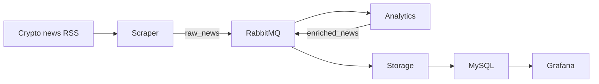

<h1 align="center">Crypto-Viz</h1>

<p align="center">
  <a href="#dart-about">About</a> &#xa0; | &#xa0; 
  <a href="#sparkles-features">Features</a> &#xa0; | &#xa0;
  <a href="#rocket-technologies">Technologies</a> &#xa0; | &#xa0;
  <a href="#white_check_mark-requirements">Requirements</a> &#xa0; | &#xa0;
  <a href="#office-Architecture">Architecture</a> &#xa0; | &#xa0;
  <a href="#checkered_flag-starting">Starting</a> &#xa0; | &#xa0;
  <a href="#family-Team">Team</a> &#xa0; | &#xa0;
  <a href="#memo-license">License</a> &#xa0; | &#xa0;
</p>

<br>

## :dart: About ##

Crypto Viz continuously collects cryptocurrency news, enriches it with online
analytics, and displays time-based insights in Grafana.

Runtime data lives in Docker volumes. Dashboards and datasource configuration are
provisioned from versioned files under `grafana/`.

## :sparkles: Features ##

:heavy_check_mark: continuously collect data from a cryptocurrency news feed ;\
:heavy_check_mark: ingest multiple configurable sources with back-pressure ;\
:heavy_check_mark: publish normalized articles to a durable RabbitMQ queue ;\
:heavy_check_mark: continuously compute sentiment, topics, and hourly aggregates ;\
:heavy_check_mark: automatically clear old raw articles while retaining aggregates ;\
:heavy_check_mark: dynamically visualize analytics with auto-refresh and time filters ;\


## :rocket: Technologies ##

The following tools were used in this project:

- [Python](https://www.python.org/)
- [Docker](https://www.docker.com/)
- [Git](https://git-scm.com)
- [Mysql](https://www.mysql.com/)
- [RabbitMQ](https://www.rabbitmq.com/)
- [Grafana](https://grafana.com/)

<h3>Libraries : </h3>

- **feedparser**: Parses the configured cryptocurrency RSS news feeds.

- **mysql-connector-python**: A MySQL connector library for Python, enabling communication between Python applications and MySQL databases.

- **pika**: A Python library for interacting with RabbitMQ, allowing for the creation, consumption, and management of messages in a RabbitMQ queue.

## :white_check_mark: Requirements ##

Before starting, install [Git](https://git-scm.com) and [Docker](https://www.docker.com/).

## :office: Architecture ##

The scraper polls configurable crypto news RSS feeds and publishes to `raw_news`.
The online analytics builder consumes that queue, computes sentiment and topics,
then publishes to `enriched_news`. A storage consumer writes deduplicated articles
and hourly aggregates to MySQL. Grafana queries those aggregates and refreshes
automatically. See [the architecture report](docs/REPORT.md) for the rationale.




<h3>Initial data</h3>

The application starts empty and fills itself from the live RSS feeds. Deterministic
article identifiers prevent duplicate rows across polling cycles.


<h3>Database : </h3>

MySQL stores deduplicated articles in `news_articles` and time-series indicators
in `analytics_hourly`.


<h3>Process GitFlow : </h3>  

Use short-lived feature branches and pull requests. Runtime databases and secrets
must never be committed.


<h3>Graphs : </h3>
- News volume by topic over time
- Average sentiment over time
- Sentiment distribution
- Latest analyzed articles
- Ingestion throughput by source
- Average pipeline latency by source


## :checkered_flag: Starting ##

```bash

# Access
$ cd CriptoVizz

# Configure local credentials
$ cp .env.example .env

# Build and launch all services
$ docker compose up --build

# Grafana: http://localhost:3000
# RabbitMQ management: http://localhost:15672

```

**<h3>Scraping Module:</h3>**

- Poll one or more RSS feeds configured with `NEWS_FEED_URLS`.
- Normalize and deduplicate articles before publishing them.
- Run continuously at the configured interval.
  
**<h3>Queue System:</h3>**

- Use `raw_news` and `enriched_news` as durable queues.
- Acknowledge messages only after successful processing.
- Route invalid messages to `raw_news.dlq` or `enriched_news.dlq` for inspection
  instead of losing them.

**<h3>Data Processing and Analytics:</h3>**

- Consume raw articles and publish enriched analytics events.
- Calculate sentiment, topics, and hourly indicators continuously.
- Persist both source articles and aggregates in MySQL.

**<h3>Database Management:</h3>**

- Set up MySQL as the database for storing processed data.
- Implement a mechanism to automatically clear old data from the database to lighten it over time.
- Consider using datetime and timedelta for managing time-related operations.

**<h3>Visualization Module:</h3>**

- Set up Grafana for dynamically visualizing analytics.
- Provision versioned time-series, distribution, and article-table panels.
- Ensure Grafana can directly query the database for real-time updates.

**<h3>Dockerization:</h3>**

- Dockerize the entire project for easy deployment and scalability.
- Provide clear instructions in the README for launching the project using Docker Compose.

**<h3>Documentation:</h3>**

- Ensure that the README contains clear and concise instructions for setting up and running the project.
- Provide information on the project's architecture, technologies used, and any additional setup requirements.


