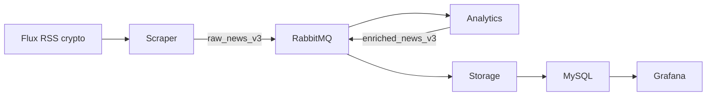

<h1 align="center">Crypto-Viz</h1>

<p align="center">
  <a href="#-présentation">Présentation</a> &#xa0; | &#xa0;
  <a href="#-fonctionnalités">Fonctionnalités</a> &#xa0; | &#xa0;
  <a href="#-technologies">Technologies</a> &#xa0; | &#xa0;
  <a href="#-prérequis">Prérequis</a> &#xa0; | &#xa0;
  <a href="#-architecture">Architecture</a> &#xa0; | &#xa0;
  <a href="#-démarrage">Démarrage</a>
</p>

## 🎯 Présentation

Crypto Viz collecte en continu des actualités sur les cryptomonnaies, les enrichit
avec des analyses en ligne et affiche des indicateurs temporels dans Grafana.

Les données d’exécution sont conservées dans des volumes Docker. Le dashboard et
la configuration de la datasource sont provisionnés depuis les fichiers versionnés
du dossier `grafana/`.

## ✨ Fonctionnalités

- Collecte continue de flux RSS d’actualités crypto.
- Ingestion de plusieurs sources configurables avec back-pressure.
- Publication d’articles normalisés dans des queues RabbitMQ durables.
- Analyse continue du sentiment, des thèmes et des agrégats horaires.
- Conservation des messages invalides dans des dead-letter queues (`.dlq`).
- Suppression automatique des articles bruts anciens, avec conservation des agrégats.
- Visualisation dynamique avec rafraîchissement automatique et filtres temporels.

## 🚀 Technologies

- [Python](https://www.python.org/)
- [Docker](https://www.docker.com/)
- [Git](https://git-scm.com)
- [MySQL](https://www.mysql.com/)
- [RabbitMQ](https://www.rabbitmq.com/)
- [Grafana](https://grafana.com/)

Bibliothèques principales :

- **feedparser** : lecture des flux RSS configurés ;
- **mysql-connector-python** : connexion aux bases MySQL ;
- **pika** : publication et consommation des messages RabbitMQ.

## ✅ Prérequis

Installer [Git](https://git-scm.com/) et [Docker Desktop](https://www.docker.com/products/docker-desktop/).

## 🏗️ Architecture

Le scraper interroge les flux RSS et publie des événements normalisés dans
`raw_news_v3`. Le service Analytics consomme cette queue, calcule le sentiment et
les thèmes, puis publie les événements enrichis dans `enriched_news_v3`. Le worker
Storage déduplique les articles, écrit les données et met à jour les agrégats
horaires dans MySQL. Grafana interroge ces agrégats automatiquement.



Les queues invalides sont routées vers `raw_news_v3.dlq` et
`enriched_news_v3.dlq`. Les messages valides utilisent une livraison au moins une
fois, avec déduplication idempotente côté MySQL.

### Données initiales

L’application démarre sans données et se remplit à partir des flux RSS actifs.
L’identifiant déterministe de chaque article évite les doublons entre deux cycles
de polling.

### Base de données

MySQL contient notamment :

- `news_articles` : articles dédupliqués et enrichis ;
- `analytics_hourly` : volumes et sentiments par heure ;
- `pipeline_hourly` : débit et latence du pipeline.

### Graphiques Grafana

- volume d’articles par thème et dans le temps ;
- sentiment moyen et distribution des sentiments ;
- derniers articles analysés ;
- débit d’ingestion par source ;
- latence moyenne et maximale par source.

## ▶️ Démarrage

```bash
# Cloner le projet
git clone https://github.com/Immooo/CriptoVizz.git
cd CriptoVizz

# Créer la configuration locale
cp .env.example .env

# Construire et lancer tous les services
docker compose up --build
```

Accès :

- Grafana : <http://localhost:3000>
- Interface RabbitMQ : <http://localhost:15672>

Pour démontrer le scaling horizontal du traitement Analytics :

```bash
docker compose up --build --scale analytics=3
```

RabbitMQ répartit les messages de `raw_news_v3` entre les trois consommateurs.
La limite de prefetch empêche une seule instance de réserver tout le backlog.

## 🧩 Services

### Scraper

- Lit les URL définies dans `NEWS_FEED_URLS`.
- Normalise et déduplique les articles avant publication.
- Recommence selon `SCRAPE_INTERVAL_SECONDS`.

### Queues

- `raw_news_v3` transporte les articles bruts.
- `enriched_news_v3` transporte les événements enrichis.
- Les `.dlq` conservent les messages invalides pour diagnostic et rejeu contrôlé.
- Un message n’est acquitté qu’après traitement réussi.

### Traitement et analyse

- Consomme les articles bruts et publie les événements enrichis.
- Calcule sentiment, thèmes et indicateurs horaires en continu.
- Persiste les articles et agrégats dans MySQL.

### Nettoyage

Le service `clean` supprime les articles bruts plus anciens que
`RETENTION_DAYS`, tout en conservant les agrégats horaires.

### Visualisation

Grafana utilise une datasource MySQL et un dashboard provisionnés depuis Git.

### Dockerisation

Docker Compose isole les services, réseaux, variables d’environnement et volumes.
Le service Analytics peut être répliqué avec `--scale` pour tester la distribution
du travail.

## 📚 Documentation complémentaire

- [Rapport d’architecture et choix techniques](docs/REPORT.md)
- [Préparation de la soutenance](docs/PREPARATION_SOUTENANCE.md)
- [Plan d’entraînement personnalisé et suivi des acquis](docs/PLAN_ENTRAINEMENT_PERSONNALISE.md)
