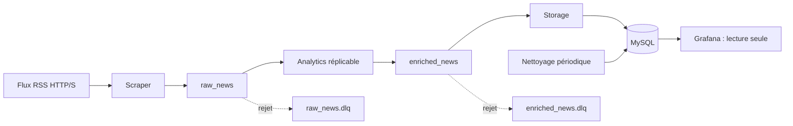

# Crypto Viz

Pipeline d’actualités crypto : collecte RSS, analyse lexicale en continu, stockage
idempotent dans MySQL et tableaux de bord Grafana. Déploiement local avec Docker
Compose ; les données persistent dans des volumes, les dashboards sont versionnés.

## Architecture



RabbitMQ porte les deux files durables. Les publications sont persistantes et
confirmées par le broker ; les consommateurs acquittent après publication confirmée
ou commit SQL. La livraison est **au moins une fois**. L’identifiant SHA-256 de l’URL
et une transaction regroupant article et agrégats rendent le stockage idempotent.
Cela ne garantit pas la récupération d’un article disparu du RSS avant sa collecte.

| Service | Rôle |
| --- | --- |
| `scrap` | Lit les flux toutes les 60 secondes ; requêtes avec timeout de 15 s et réponse limitée à 2 Mio. |
| `analytics` | Calcule sentiment et thèmes par lexique ; valide le contrat des événements. |
| `queue` | Valide et stocke ; met à jour les agrégats horaires dans une transaction. |
| `clean` | Supprime les articles de plus de `RETENTION_DAYS` ; conserve les agrégats. |
| `mysql` | Tables `news_articles`, `analytics_hourly`, `pipeline_hourly`. |
| `rabbitmq` | Files de travail et files de rejet pour diagnostic. |
| `grafana` | Dashboard provisionné, compte MySQL limité à `SELECT`. |

Les articles déjà hors rétention sont ignorés à l’ingestion pour empêcher leur
recomptage après nettoyage. Le sentiment est une heuristique anglaise, pas un modèle
financier prédictif. Les comptes par thème peuvent compter plusieurs fois un article
multithème ; `pipeline_hourly` mesure les articles uniques ingérés.

## Installation neuve

Prérequis : Git, Docker avec Compose v2 et Python 3.11+ pour générer la configuration
(les conteneurs et la CI utilisent Python 3.12).

```bash
git clone https://github.com/Immooo/CriptoVizz.git
cd CriptoVizz
python script/setup-env.py
docker compose config --quiet
docker compose up -d --build --wait
```

Le générateur crée `.env` avec des secrets aléatoires et refuse d’écraser un fichier
existant. **Ne pas copier simplement `.env.example` : les secrets requis sont vides.**
Les volumes existants demandent la procédure de [mise à niveau](docs/OPERATIONS.md).

| Accès local | Connexion |
| --- | --- |
| [Grafana](http://localhost:3000) | `admin` / valeur de `GRAFANA_ADMIN_PASSWORD` dans `.env` |
| [RabbitMQ](http://localhost:15672) | valeur de `RABBITMQ_USER` / `RABBITMQ_PASSWORD` |
| MySQL, port 3306 | compte applicatif défini dans `.env` |

Les ports publiés écoutent uniquement sur `127.0.0.1`. Le dashboard apparaît dans
Grafana grâce au provisioning de `grafana/` ; sélectionner une période avec des données.
Le chargement dépend de la disponibilité des flux externes.

## Configuration

| Variable | Valeur / contrainte |
| --- | --- |
| `NEWS_FEED_URLS` | URL HTTP(S) séparées par des virgules, sources de confiance uniquement. |
| `SCRAPE_INTERVAL_SECONDS` | `60`, entier strictement positif. |
| `RAW_NEWS_QUEUE`, `ANALYTICS_QUEUE` | `raw_news`, `enriched_news`. |
| `DEAD_LETTER_EXCHANGE` | `dead_letter`. |
| `ANALYTICS_PREFETCH_COUNT`, `STORAGE_PREFETCH_COUNT` | `50`, entier strictement positif. |
| `RETENTION_DAYS` | `30`, entier strictement positif. |
| `MYSQL_DATABASE`, `MYSQL_USER` | `crypto` par défaut. Nom de base alphanumérique ou `_`. |
| `MYSQL_PASSWORD`, `MYSQL_ROOT_PASSWORD` | Secrets générés, distincts. |
| `GRAFANA_ADMIN_PASSWORD` | Secret initial ; sa modification ne réinitialise pas un compte existant. |
| `GRAFANA_DB_PASSWORD` | Secret hexadécimal pour le compte `grafana_reader`. |
| `RABBITMQ_USER`, `RABBITMQ_PASSWORD` | Compte dédié, créé lors de la première initialisation. |
| `RABBITMQ_URL` | Optionnel : remplace la connexion au broker interne. Ne jamais versionner cette URL avec ses secrets. |

## Développement et vérification

```bash
python -m venv .venv
# Linux/macOS : source .venv/bin/activate
# PowerShell : .venv/Scripts/Activate.ps1
python -m pip install -r requirements-dev.txt
python -m unittest discover -s tests -v
ruff check app tests script
ruff format --check app tests script
bandit -r app -ll
pip-audit -r app/scrap/requirements.txt -r app/analytics/requirements.txt -r app/queue/requirements.txt -r app/clean/requirements.txt
```

Sur une pile de test démarrée :

```bash
# Linux/macOS
docker compose exec -T queue python - < tests/integration_pipeline.py
# PowerShell
Get-Content -Raw tests/integration_pipeline.py | docker compose exec -T queue python -
```

Le test crée puis retire ses données synthétiques. Il vérifie la déduplication,
les agrégats et le routage des messages invalides vers les deux DLQ. Préférer une
pile isolée : le test peut temporairement réserver des messages préexistants en DLQ.
La CI GitHub exécute formatage, lint, tests, audit des dépendances et intégration Docker.
Dependabot propose les mises à jour Python, Dockerfiles et GitHub Actions ; les
versions des services dans Compose doivent aussi être revues régulièrement.

## Exploitation

```bash
docker compose ps
docker compose logs --tail 100 -f analytics queue
docker compose up -d --scale analytics=3
docker compose stop
```

Ne pas utiliser `docker compose down -v` sur une pile à conserver : cela supprime ses
volumes. Les procédures de sauvegarde, migration et récupération Grafana sont dans
[OPERATIONS.md](docs/OPERATIONS.md).

## Sécurité et limites

Le projet cible une machine locale de confiance, pas une exposition Internet directe.
Les workers tournent sans root, avec système de fichiers en lecture seule et sans
capabilities Linux. Les secrets sont exclus de Git et du contexte de construction.
Les messages sont bornés et validés ; les requêtes SQL utilisent des paramètres.

Une production exige TLS, gestion centralisée des secrets, comptes SQL séparés pour
écriture/nettoyage/migrations, sauvegardes restaurées régulièrement, quotas des files,
alertes de backlog/DLQ et haute disponibilité. Les volumes et communications internes
ne sont pas chiffrés par cette configuration. Le compte Docker de l’hôte reste privilégié.

Voir [l’audit et ses limites](docs/SECURITY_REVIEW.md), le
[rapport d’architecture](docs/RAPPORT_ARCHITECTURE.md) et la
[politique de sécurité](SECURITY.md).

### Périodes courtes dans Grafana

Jusqu’à 24 heures, les volumes et sentiments utilisent les dates exactes des articles
et des intervalles adaptatifs (minimum une minute). Les plages plus longues conservent
les agrégats horaires historiques. La latence reste une moyenne horaire des blocs qui
recouvrent la période. Sans nouvel article dans la fenêtre, une absence de données est normale.

`python tests/integration_dashboard.py` vérifie les requêtes via Grafana avec des données
fictives en lecture seule : fenêtre de cinq minutes, limites temporelles, filtres et historique.
