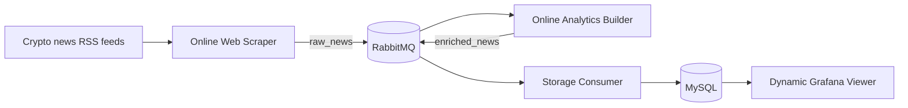

# Crypto Viz - Architecture and technical choices

## Objective

Crypto Viz continuously collects cryptocurrency news, analyzes each article, and
displays time-based indicators for decision makers. The application runs locally
with Docker Compose and separates collection, processing, persistence, and
visualization so that each part can scale independently.

## Architecture



The scraper collects several independent feeds and is the producer of normalized news events. The analytics builder is
both a consumer of `raw_news` and a producer of `enriched_news`, satisfying the
producer/consumer requirement. The storage worker consumes enriched events and
updates both the source table and hourly aggregates. Grafana reads these
aggregates every 30 seconds and lets users explore a time range and topic.

## Data and analytics

Each article has a deterministic SHA-256 identifier derived from its URL. This
makes repeated RSS polling idempotent. The normalized event includes its source,
title, summary, URL, publication time, and collection time.

The online analytics builder produces:

- a lexical sentiment score between -1 and 1 and a positive/neutral/negative label;
- topic detection for Bitcoin, Ethereum, regulation, DeFi, security, and markets;
- hourly article counts and sentiment distributions, materialized in MySQL.
- pipeline throughput and processing-latency measurements grouped by hour and source.

The lexical method is deterministic, fast, explainable, and has no external model
dependency. Its limitation is that it does not understand sarcasm or complex
context; replacing it with a trained model is a possible future improvement.

## Technical choices

- **RabbitMQ:** durable queues, persistent messages, acknowledgements after
  successful processing, and bounded prefetch provide back-pressure and recovery.
- **MySQL:** stores deduplicated articles and query-friendly hourly aggregates.
- **Grafana:** provisions its datasource and dashboard from versioned files. The
  viewer includes automatic refresh and temporal filtering.
- **Docker Compose:** provides one-command local deployment and isolated networks.
- **Python:** keeps the three online workers small and independently deployable.

## Big-data orientation and scalability

The project applies useful big-data patterns without adding unnecessary cluster
infrastructure. Events are streamed instead of processed as a monolithic batch,
queues absorb traffic spikes, and configurable prefetch limits apply back-pressure.
Deterministic identifiers make delivery idempotent, while compact hourly tables
avoid repeatedly scanning all raw articles for dashboard queries. The dashboard
also exposes ingestion throughput and end-to-end processing latency per source.

Collection sources and worker prefetch values are environment-driven. For a larger
workload, several analytics or storage worker replicas can consume the same queue;
RabbitMQ distributes messages between them and MySQL uniqueness prevents duplicate
articles. Kafka, Spark, and a data lake are deliberately deferred until volume or
retention requirements justify their operational cost.

The Analytics service deliberately has no fixed Compose `container_name`, so its
consumer group can be demonstrated locally with
`docker compose up --build --scale analytics=3`. This is horizontal scaling of the
stateless processing stage; RabbitMQ and MySQL remain single-node dependencies in
the local prototype.

## Reliability and operations

Workers reconnect when RabbitMQ or MySQL is temporarily unavailable. Invalid
messages are rejected into durable dead-letter queues, while transient processing
failures are requeued. The DLQs preserve the failed payloads for diagnosis and
controlled replay instead of retrying permanent errors forever. Database
credentials are supplied through environment variables. Runtime data is stored in
Docker volumes and is not committed to Git. Raw articles are retained for 30 days
by default; compact hourly analytics remain available for longer-term trends.

## Deployment and verification

Copy `.env.example` to `.env`, replace development passwords, then run:

```bash
docker compose up --build
```

Grafana is available at <http://localhost:3000> and RabbitMQ management at
<http://localhost:15672>. Verification should cover the two queues, newly stored
articles, growing hourly aggregates, and dashboard refresh over several cycles.
